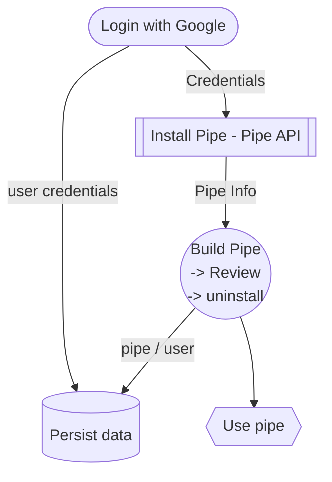

## HIGHLEVEL

```mermaid
flowchart TD
Start([Login with Google]) --> |Credentials| PipeServer[[Install Pipe - Pipe API]]
Start --> |user credentials| Save[(Persist data)]
PipeServer --> |Pipe Info| Builder((Build Pipe \n -> Review  \n -> uninstall))
Builder --> |pipe / user| Save[(Persist data)]
Builder -->D{{Use pipe}}
```

## PIPE INSTALLATION

