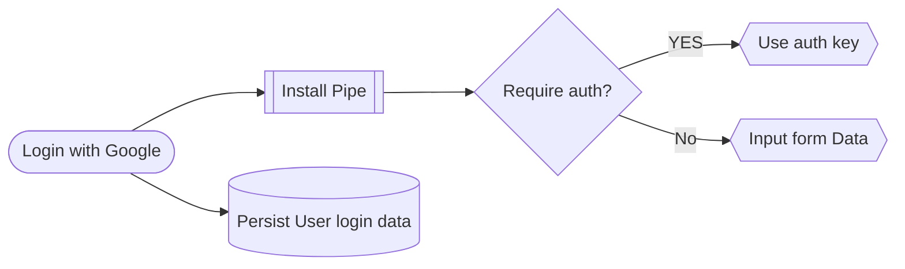

## HIGHLEVEL

```mermaid
flowchart LR
Start([Login with Google]) --> B[[Install Pipe]]
Start --> Save[(Persist User login data)]
B --> C{Require auth?}
C -->|YES| D{{Use auth key}}
C -->|No| E{{Input form Data}}
```

## PIPE INSTALLATION

